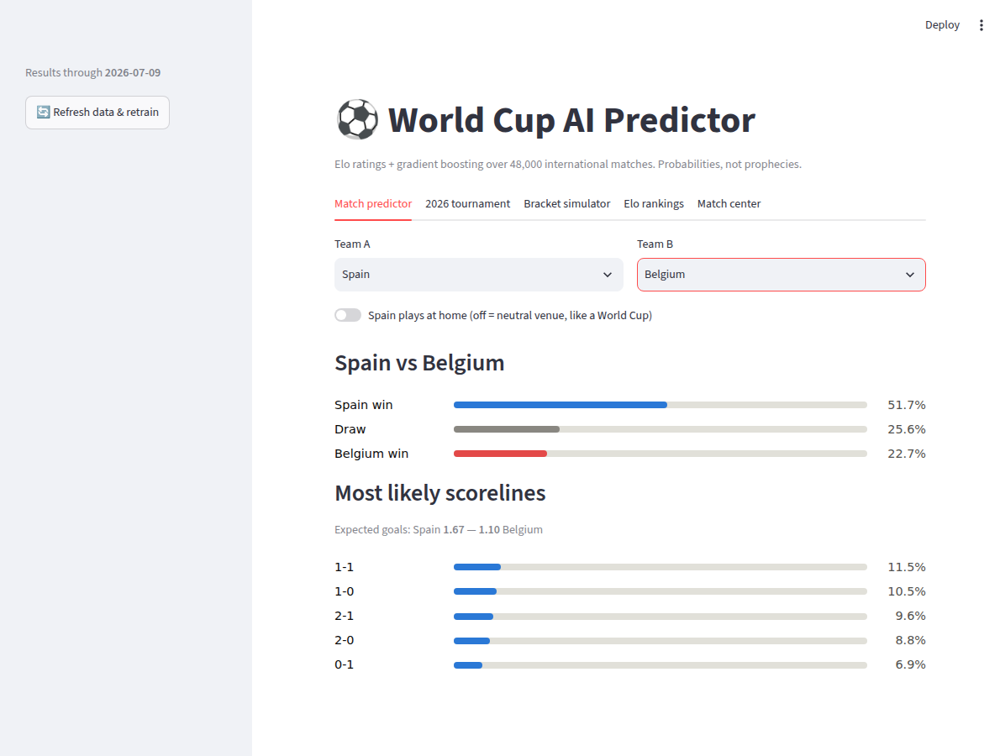
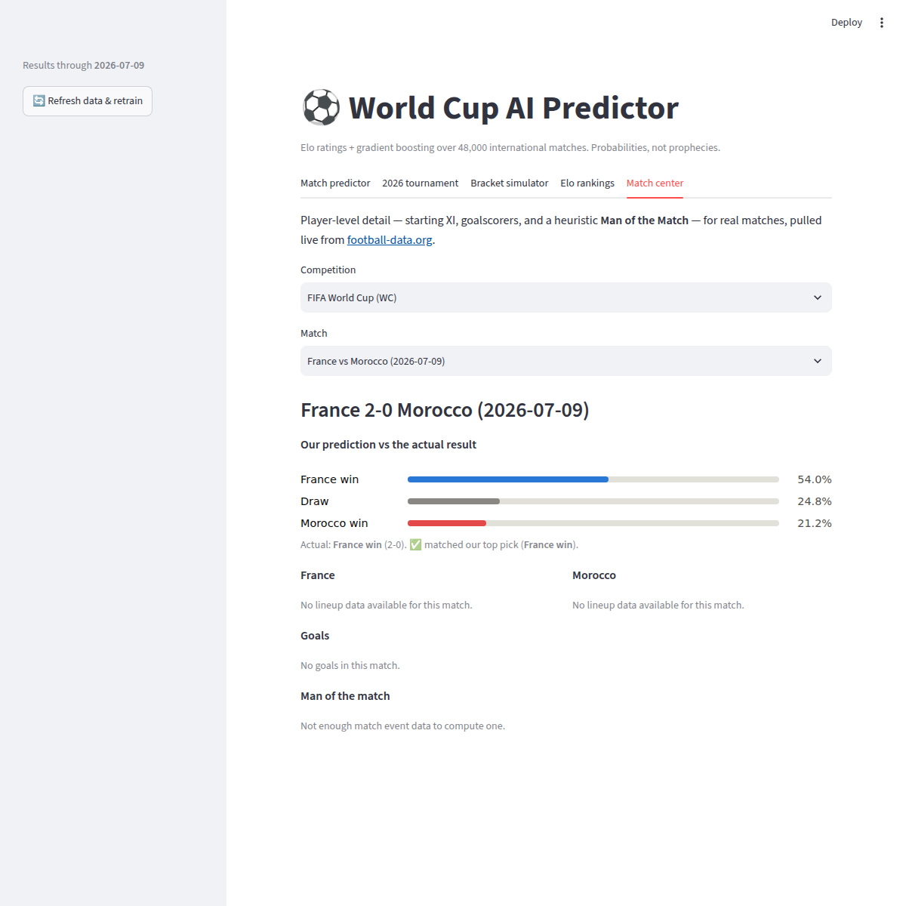

# World Cup AI Predictor ⚽

A lightweight but powerful AI that predicts international football matches and
simulates World Cup brackets. No GPU, no deep learning required — just
well-engineered features and gradient boosting, which is the sweet spot for
this problem size. An optional "Match center" adds player-level detail
(first XI, goalscorers) for real matches via the football-data.org API.



*Spain vs Belgium — an actual 2026 World Cup fixture — predicted from the
Streamlit match predictor tab.*

## How it works

1. **Data** — ~48,000 international matches since 1872 from the open
   [martj42/international_results](https://github.com/martj42/international_results)
   dataset (auto-downloaded on first run, includes upcoming fixtures).
2. **Features** (`src/elo.py`) — computed chronologically with zero leakage:
   - **Elo ratings** with tournament-weighted K-factor (World Cup > qualifiers > friendlies)
     and margin-of-victory scaling — the single strongest signal in football.
   - Home advantage (+60 Elo, disabled on neutral ground).
   - Recent form, attack and defense averages over the last 5 matches.
3. **Models** (`src/model.py`) — scikit-learn `HistGradientBoostingClassifier`
   for win/draw/loss probabilities, plus two Poisson gradient-boosted
   regressors for expected goals, which give exact-scoreline probabilities
   (`src/scoreline.py`).
4. **Tournament simulation** (`src/simulate.py`) — Monte Carlo: play out the
   knockout bracket 10,000 times to get each team's chance of lifting the cup.
5. **Match center** (`src/matchcenter.py`, optional) — player-level detail for
   real matches (first XI, goalscorers, a heuristic Man of the Match) pulled
   live from the [football-data.org](https://www.football-data.org/) API.
   This is the one place the project talks to an external API/key — see below.

**Current performance** (held-out last 4 years, ~4,000 matches):
60.7% three-way accuracy, log loss 0.871 (vs 1.053 naive baseline) —
on par with published football-prediction models.

## Quick start

```bash
pip install -r requirements.txt

# Web UI — match predictor, tournament & bracket simulators, Elo rankings.
# The sidebar shows how fresh the data is; one click on "Refresh data &
# retrain" pulls the latest results and rebuilds the model (~1 min).
streamlit run app.py

# 1. Download data + train (takes ~1 minute)
python -m src.model

# 2. Predict a match (neutral venue by default, like a World Cup)
python -m src.predict "France" "Morocco"

# 3. Simulate a knockout bracket (teams in bracket order)
python -m src.simulate "Argentina" "Egypt" "Switzerland" "Colombia" \
                       "France" "Morocco" "Brazil" "Spain" -n 10000

# 4. Simulate the FULL 2026 World Cup from the group stage
python -m src.tournament -n 10000

# 5. Match center: first XI, goalscorers, heuristic Man of the Match
# (needs a free football-data.org API key — see "Match center" below)
export FOOTBALL_DATA_API_KEY="your-key-here"
python -m src.matchcenter WC --matchday 1
```

Example output:

```
France vs Morocco  (neutral venue)
  France win  :  49.0%
  Draw        :  26.9%
  Morocco win :  24.1%
```

## Project layout

```
app.py         # Streamlit web UI                        (streamlit run app.py)
src/
  data.py      # dataset download + loading (played matches & upcoming fixtures)
  elo.py       # Elo ratings + rolling form, computed match-by-match
  model.py     # training, evaluation, artifact saving   (python -m src.model)
  predict.py   # single-match CLI                        (python -m src.predict)
  simulate.py  # Monte Carlo knockout simulation         (python -m src.simulate)
  tournament.py# full tournament: groups + knockout      (python -m src.tournament)
  football_data.py # football-data.org API client (competitions, matches)
  matchcenter.py    # first XI / goalscorers / Man of the Match (python -m src.matchcenter)
```

The 2026 groups aren't hardcoded — `tournament.py` recovers them from the
fixture list by finding the 4-team connected components of the group-stage
match graph. Group games sample full scorelines so points, goal difference
and goals-for drive the standings like the real tiebreakers; the top 2 per
group plus the 8 best thirds are seeded into the round-of-32 bracket.

## Match center (player features)



*France vs Morocco (2-0) — our model called France to win at 54.0% before
kickoff, so it's marked ✅. On a free football-data.org key, lineups/goals
aren't included (see the caveat below), so that part of the tab shows that
plainly instead of guessing.*

The rest of the project needs no API key. This one feature does, because
real-match data — lineups, goals, results — isn't in the open historical
dataset the rest of the app trains on. It comes live from
[football-data.org](https://www.football-data.org/).

1. Register for a free key: https://www.football-data.org/client/register
2. Make it available to the app one of two ways (never commit it to git —
   both paths below are already git-ignored):
   - **Local run:** `export FOOTBALL_DATA_API_KEY="your-key-here"`
   - **Deployed app (e.g. Streamlit Community Cloud) shared by one key for
     all visitors:** copy `.streamlit/secrets.toml.example` to
     `.streamlit/secrets.toml` and paste your key in (or paste the same
     content into the host's Secrets settings). Streamlit exposes root-level
     `secrets.toml` keys as environment variables automatically, so no code
     change is needed either way.
3. Pick a competition (World Cup, Euros, Champions League, Premier League —
   the ones covered by the free tier) and any match. You'll see:
   - **Our prediction vs the actual result** — the same Elo/gradient-boosting
     model from the match predictor tab, run on the two real teams, with a
     ✅/❌ marker against the final score once the match has been played.
     For club competitions (Champions League, Premier League) the model has
     no rating for those teams, so this just says so instead of guessing.
   - **First XI** — starting lineup and formation for each side.
   - **Goalscorers** — minute, scorer, assist, per goal.
   - **Man of the match** — *heuristic*, not an official award: football-data.org
     doesn't publish one, so `src/matchcenter.py` scores goals (+4, own goals
     −2), assists (+2) and cards (yellow −1, red −3), with a small bonus for
     being on the winning side.

**Free-tier caveat:** football-data.org's free plan covers World Cup/Euro/
league fixtures and scores, but lineups, substitutions and cards are a paid
add-on ("player data"). On a free key, the app still works — it just shows
"no lineup data available" / "not enough match data" instead of erroring.
Everything here degrades gracefully rather than crashing when a match has
partial or no player data.

## Roadmap

- [x] Group-stage simulation (points, goal difference, tiebreakers) for full-tournament odds
- [x] Poisson goal model for expected goals + exact scoreline probabilities
- [ ] Probability calibration (isotonic) + Brier score tracking
- [x] Streamlit web UI (match predictor, bracket simulator, Elo rankings)
- [x] One-click refresh-and-retrain from the app sidebar
- [ ] Auto-refresh data weekly and re-train (scheduled)
- [x] Match center: first XI, goalscorers, heuristic Man of the Match (football-data.org)
